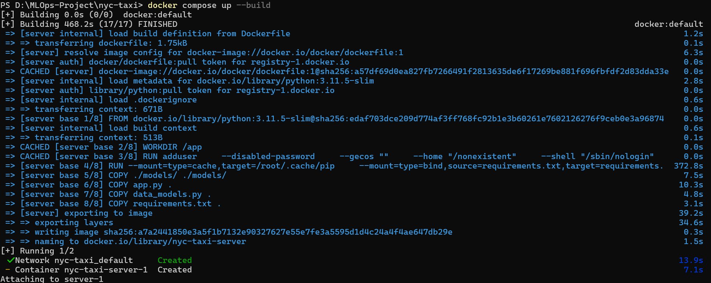

# NYC-Taxi

==============================

Machine Learning project to predict trip duration for taxis in NYC

## Important

This code will give error until the project is installed as a package in the environment that has all the dependencies for the project.

After creation of environment and installation of all required packages using pip run this command in the command terminal.

```cmd
pip install -e .
```

| This will fix all the import statement errors such as `ModuleNotFoundError` when recreating pipelines using command

```cmd
dvc repro
```

## CI/CD through GitHub Acti ons

The CI/CD workflow will throw an error while creating the CML report because no Personal Access Token is linked to the repository for safety purposes.

I advice the user to generate his/her own access token and run this code in their own repository and it will work without any errors.

## Docker

Download Docker Desktop from the link [download here](https://www.docker.com/products/docker-desktop/)

Once you are in project folder just type in the command

```cmd
docker init
```

The result will show something like this


> It is advised to check the DOCKERFILE before committing to the build image phase. You can check the DOCKERFILE in the project.

The next command to run is

```cmd
docker compose up --build
```



## Project Organization

------------

    ├── LICENSE
    ├── Makefile           <- Makefile with commands like `make data` or `make train`
    ├── README.md          <- The top-level README for developers using this project.
    ├── data
    │   ├── external       <- Data from third party sources.
    │   ├── interim        <- Intermediate data that has been transformed.
    │   ├── processed      <- The final, canonical data sets for modeling.
    │   └── raw            <- The original, immutable data dump.
    │
    ├── docs               <- A default Sphinx project; see sphinx-doc.org for details
    │
    ├── models             <- Trained and serialized models, model predictions, or model summaries
    │
    ├── notebooks          <- Jupyter notebooks. Naming convention is a number (for ordering),
    │                         the creator's initials, and a short `-` delimited description, e.g.
    │                         `1.0-jqp-initial-data-exploration`.
    │
    ├── references         <- Data dictionaries, manuals, and all other explanatory materials.
    │
    ├── reports            <- Generated analysis as HTML, PDF, LaTeX, etc.
    │   └── figures        <- Generated graphics and figures to be used in reporting
    │
    ├── requirements.txt   <- The requirements file for reproducing the analysis environment, e.g.
    │                         generated with `pip freeze > requirements.txt`
    │
    ├── setup.py           <- makes project pip installable (pip install -e .) so src can be imported
    ├── src                <- Source code for use in this project.
    │   ├── __init__.py    <- Makes src a Python module
    │   │
    │   ├── data           <- Scripts to download or generate data
    │   │   └── make_dataset.py
    │   │
    │   ├── features       <- Scripts to turn raw data into features for modeling
    │   │   └── build_features.py
    │   │
    │   ├── models         <- Scripts to train models and then use trained models to make
    │   │   │                 predictions
    │   │   ├── predict_model.py
    │   │   └── train_model.py
    │   │
    │   └── visualization  <- Scripts to create exploratory and results oriented visualizations
    │       └── visualize.py
    │
    └── tox.ini            <- tox file with settings for running tox; see tox.readthedocs.io

------------
